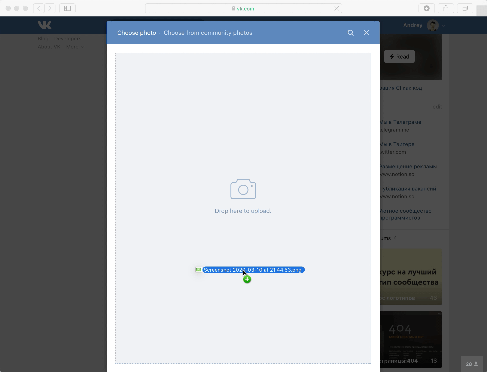

# Drag-and-drop загрузка файлов

При реализации формы с полем загрузки файлов хорошим тоном считается поддержка drag-and-drop, чтобы пользователь мог перетащить нужный файл из проводника в форму.

Часто размеры области, на которую нужно бросить перетаскиваемый файл, ограничивают:

Если поле загрузки файлов всего одно, такое ограничение обосновать сложно, а пользователю оно мешает: чем меньше доступная область, тем сложнее пользователю в неё попасть и тем проще промахнуться.

Более дружелюбный к пользователям подход — растянуть доступную для перетаскивания область на весь экран. Так, например, сделано в [Амплифере](https://amplifr.com) и на ГитХабе:

Если полей для загрузки файлов на странице несколько (например, при загрузке сканов нескольких документов), доступную для перетаскивания область всё равно можно растянуть на весь экран и разделить на области для каждого поля. Скорее всего, эти области будут всё ещё достаточно большими.
